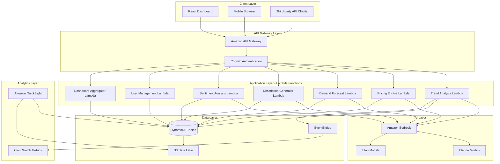

# Design Document: BharatBazaar AI

## Overview

BharatBazaar AI is a cloud-native, serverless intelligent market assistant built on AWS infrastructure. The system leverages Amazon Bedrock's foundation models (Claude and Titan) to provide AI-powered market intelligence specifically tailored for India's diverse retail ecosystem. The architecture follows a microservices pattern with event-driven processing, enabling scalability and cost-effectiveness for SMB users.

The platform consists of five core AI-powered features:
1. **Market Trend Analyzer** - Identifies trending products by category and region
2. **Smart Pricing Engine** - Generates optimal pricing recommendations
3. **Demand Forecaster** - Predicts seasonal and regional demand patterns
4. **Product Description Generator** - Creates multilingual product listings
5. **Sentiment Analyzer** - Extracts insights from customer reviews

The system is designed to handle India's linguistic diversity (supporting Hindi, Tamil, Bengali, Gujarati, Marathi, and English), regional market variations, and the unique needs of small retailers, D2C brands, and regional sellers.

## Architecture

### High-Level Architecture




### Architecture Principles

1. **Serverless-First**: All compute uses AWS Lambda for automatic scaling and cost optimization
2. **Event-Driven**: EventBridge orchestrates asynchronous processing and model updates
3. **AI-Native**: Amazon Bedrock provides foundation models without infrastructure management
4. **Regional Awareness**: Data partitioning by region for localized insights
5. **Multilingual Support**: All AI components handle multiple Indian languages natively
6. **Security**: Cognito for authentication, IAM for authorization, encryption at rest and in transit

### Technology Stack

- **Frontend**: React 18+ with TypeScript, Material-UI for responsive design
- **API Layer**: Amazon API Gateway (REST APIs) with request validation
- **Compute**: AWS Lambda (Node.js 20.x runtime for consistency)
- **AI/ML**: Amazon Bedrock (Claude 3 for reasoning, Titan for embeddings)
- **Database**: Amazon DynamoDB (single-table design with GSIs)
- **Storage**: Amazon S3 (data lake for historical data and model artifacts)
- **Authentication**: Amazon Cognito (user pools with MFA support)
- **Analytics**: Amazon QuickSight (embedded dashboards)
- **Monitoring**: CloudWatch (logs, metrics, alarms)
- **Event Processing**: Amazon EventBridge (event routing and scheduling)

## Components and Interfaces

### 1. Market Trend Analyzer

**Purpose**: Analyzes market data to identify trending products by category and region, providing retailers with actionable insights on what to stock.

**Lambda Function**: `TrendAnalysisFunction`

**Input Interface**:
```typescript
interface TrendAnalysisRequest {
  userId: string;
  category: string;           // e.g., "Electronics", "Fashion", "Groceries"
  region: string;             // e.g., "North", "South", "East", "West", "Metro"
  timeframe?: string;         // "7d", "30d", "90d" (default: "30d")
  includeHistorical?: boolean; // Compare with previous periods
}
```

**Output Interface**:
```typescript
interface TrendAnalysisResponse {
  trends: TrendItem[];
  metadata: {
    category: string;
    region: string;
    analyzedAt: string;
    dataFreshness: string;
  };
}

interface TrendItem {
  productId: string;
  productName: string;
  popularityScore: number;     // 0-100
  trendDirection: "rising" | "stable" | "declining";
  regionalVariation: {
    region: string;
    strength: number;          // 0-100
  }[];
  seasonalIndicators: {
    season: string;
    impact: "high" | "medium" | "low";
  }[];
  historicalComparison?: {
    previousPeriod: string;
    changePercent: number;
  };
}
```


**Processing Logic**:
1. Retrieve market data from DynamoDB (MarketData table, partitioned by category-region)
2. Query Bedrock Claude model with prompt containing market data and analysis requirements
3. Parse AI response to extract trending products with scores
4. Enrich with regional variation data from GSI queries
5. Add seasonal indicators based on calendar and historical patterns
6. Cache results in DynamoDB (TrendCache table) with 6-hour TTL
7. Return formatted response

**Bedrock Integration**:
- Model: Claude 3 Sonnet (for balanced performance and cost)
- Prompt Template: "Analyze the following market data for {category} in {region}. Identify top 20 trending products based on search volume, sales velocity, and social mentions. Rank by popularity score (0-100) and indicate trend direction..."
- Max Tokens: 4000
- Temperature: 0.3 (lower for consistent analytical output)

### 2. Smart Pricing Engine

**Purpose**: Generates optimal pricing recommendations by analyzing competitor pricing, demand elasticity, and regional purchasing power.

**Lambda Function**: `PricingEngineFunction`

**Input Interface**:
```typescript
interface PricingRequest {
  userId: string;
  productDetails: {
    name: string;
    category: string;
    currentPrice?: number;
    costPrice?: number;
    targetMargin?: number;
  };
  region: string;
  competitorUrls?: string[];   // Optional competitor product URLs
}
```

**Output Interface**:
```typescript
interface PricingResponse {
  recommendations: PriceRecommendation[];
  marketContext: {
    averageCompetitorPrice: number;
    priceRange: { min: number; max: number };
    regionalPurchasingPower: number; // Index 0-100
  };
  generatedAt: string;
}

interface PriceRecommendation {
  strategy: "competitive" | "premium" | "value";
  suggestedPrice: number;
  confidenceScore: number;      // 0-100
  expectedImpact: {
    demandChange: string;       // e.g., "+15%"
    revenueChange: string;      // e.g., "+8%"
  };
  reasoning: string;
  regionalAdjustment: number;   // Multiplier based on purchasing power
}
```

**Processing Logic**:
1. Fetch competitor pricing data from DynamoDB (CompetitorPricing table)
2. If competitorUrls provided, scrape pricing (via separate scraper Lambda)
3. Retrieve regional purchasing power index from RegionalData table
4. Query demand elasticity data if available (DemandElasticity table)
5. Construct prompt with all context for Bedrock Claude
6. Parse AI recommendations and calculate confidence scores
7. Apply regional adjustments to base recommendations
8. Store recommendations in DynamoDB (PricingHistory table)
9. Return formatted response

**Bedrock Integration**:
- Model: Claude 3 Sonnet
- Prompt Template: "You are a pricing strategist for Indian retail markets. Analyze this product: {product_details}. Competitor prices: {competitor_data}. Regional purchasing power index: {regional_index}. Provide 3 pricing strategies (competitive, premium, value) with specific prices and reasoning..."
- Max Tokens: 3000
- Temperature: 0.4


### 3. Demand Forecaster

**Purpose**: Predicts future demand patterns accounting for seasonality, regional festivals, and historical trends to optimize inventory planning.

**Lambda Function**: `DemandForecastFunction`

**Input Interface**:
```typescript
interface DemandForecastRequest {
  userId: string;
  productId: string;
  region: string;
  forecastPeriods: ("3m" | "6m" | "12m")[];
  historicalSalesData?: SalesDataPoint[]; // User's own sales history
}

interface SalesDataPoint {
  date: string;
  quantity: number;
  revenue: number;
}
```

**Output Interface**:
```typescript
interface DemandForecastResponse {
  forecasts: ForecastPeriod[];
  insights: {
    upcomingEvents: FestivalEvent[];
    seasonalPatterns: string[];
    externalFactors: string[];
  };
  accuracy: {
    historicalAccuracy?: number; // If past forecasts exist
    confidenceLevel: "high" | "medium" | "low";
  };
}

interface ForecastPeriod {
  period: "3m" | "6m" | "12m";
  predictions: MonthlyPrediction[];
}

interface MonthlyPrediction {
  month: string;
  predictedDemand: number;
  confidenceInterval: {
    lower: number;
    upper: number;
  };
  factors: string[];           // Key factors influencing this prediction
}

interface FestivalEvent {
  name: string;
  date: string;
  expectedImpact: "high" | "medium" | "low";
  category: string;
}
```

**Processing Logic**:
1. Retrieve historical market demand data from DynamoDB (DemandHistory table)
2. If user provides sales data, merge with market data for personalization
3. Fetch regional festival calendar from RegionalData table
4. Query economic indicators and external factors from ExternalData table
5. Construct time-series data with all contextual information
6. Send to Bedrock Claude with forecasting prompt
7. Parse predictions and calculate confidence intervals
8. Identify upcoming festivals and seasonal patterns
9. Store forecast in DynamoDB (ForecastHistory table) for accuracy tracking
10. Return formatted response

**Bedrock Integration**:
- Model: Claude 3 Sonnet (for complex time-series reasoning)
- Prompt Template: "Analyze this historical demand data for {product} in {region}: {time_series_data}. Upcoming festivals: {festivals}. Economic indicators: {indicators}. Provide demand forecasts for 3, 6, and 12 months with confidence intervals. Consider seasonal patterns and regional events..."
- Max Tokens: 5000
- Temperature: 0.3


### 4. Product Description Generator

**Purpose**: Creates culturally appropriate, SEO-optimized product descriptions in multiple Indian languages to help retailers reach diverse customer bases.

**Lambda Function**: `DescriptionGeneratorFunction`

**Input Interface**:
```typescript
interface DescriptionGenerationRequest {
  userId: string;
  productInfo: {
    name: string;
    category: string;
    features: string[];
    specifications: Record<string, string>;
    targetAudience?: string;
  };
  targetLanguages: ("hi" | "ta" | "bn" | "gu" | "mr" | "en")[];
  tone?: "formal" | "casual" | "persuasive";
  length?: "short" | "medium" | "long";
}
```

**Output Interface**:
```typescript
interface DescriptionGenerationResponse {
  descriptions: MultilingualDescription[];
  seoKeywords: {
    language: string;
    keywords: string[];
  }[];
  generatedAt: string;
}

interface MultilingualDescription {
  language: string;
  languageName: string;        // e.g., "Hindi", "Tamil"
  title: string;
  description: string;
  bulletPoints: string[];
  culturalNotes?: string;      // Any cultural adaptations made
  localSearchTerms: string[];  // Region-specific search terms
}
```

**Processing Logic**:
1. Validate product information completeness
2. Retrieve category-specific templates from DynamoDB (DescriptionTemplates table)
3. Fetch regional preferences for target languages (RegionalPreferences table)
4. For each target language:
   - Construct prompt with product info, cultural context, and tone requirements
   - Query Bedrock Claude for description generation
   - Extract SEO keywords using Bedrock Titan embeddings
   - Validate cultural appropriateness
5. Store generated descriptions in DynamoDB (GeneratedContent table)
6. Return all descriptions with metadata

**Bedrock Integration**:
- Model: Claude 3 Sonnet (for multilingual generation with cultural awareness)
- Prompt Template: "Generate a product description in {language} for: {product_info}. Target audience: {audience}. Tone: {tone}. Cultural context: {cultural_notes}. Ensure the description is culturally appropriate, uses local idioms naturally, and includes region-specific search terms. Format: Title, Description (2-3 paragraphs), 5 bullet points highlighting key features..."
- Max Tokens: 2000 per language
- Temperature: 0.6 (higher for creative content)
- Separate API calls for each language to ensure quality


### 5. Sentiment Analyzer

**Purpose**: Extracts actionable insights from customer reviews across multiple languages, identifying sentiment trends and improvement opportunities.

**Lambda Function**: `SentimentAnalysisFunction`

**Input Interface**:
```typescript
interface SentimentAnalysisRequest {
  userId: string;
  productId: string;
  reviews: Review[];
  analysisDepth?: "basic" | "detailed";
}

interface Review {
  reviewId: string;
  text: string;
  language?: string;           // Auto-detect if not provided
  rating?: number;             // 1-5 stars
  date: string;
}
```

**Output Interface**:
```typescript
interface SentimentAnalysisResponse {
  overallSentiment: {
    score: number;              // -100 to +100
    label: "positive" | "neutral" | "negative";
    distribution: {
      positive: number;
      neutral: number;
      negative: number;
    };
  };
  keyThemes: Theme[];
  productAttributes: AttributeSentiment[];
  actionableInsights: Insight[];
  trendAnalysis?: {
    direction: "improving" | "stable" | "declining";
    changePercent: number;
    timeframe: string;
  };
  languageBreakdown: {
    language: string;
    reviewCount: number;
    avgSentiment: number;
  }[];
}

interface Theme {
  theme: string;
  frequency: number;
  sentiment: number;
  exampleReviews: string[];
}

interface AttributeSentiment {
  attribute: string;           // e.g., "quality", "price", "delivery"
  sentiment: number;
  mentionCount: number;
  keyPhrases: string[];
}

interface Insight {
  category: "improvement" | "strength" | "concern";
  priority: "high" | "medium" | "low";
  description: string;
  affectedReviewCount: number;
  suggestedAction?: string;
}
```

**Processing Logic**:
1. Validate and preprocess reviews (language detection if needed)
2. Batch reviews by language for efficient processing
3. For each language batch:
   - Send to Bedrock Claude for sentiment extraction
   - Parse sentiment scores, themes, and attributes
4. Aggregate results across all languages
5. Identify cross-language patterns and themes
6. Generate actionable insights based on negative sentiment clusters
7. If historical data exists, calculate sentiment trends
8. Store analysis in DynamoDB (SentimentHistory table)
9. Return comprehensive analysis

**Bedrock Integration**:
- Model: Claude 3 Sonnet (for nuanced multilingual sentiment understanding)
- Prompt Template: "Analyze these product reviews in {language}: {reviews}. Extract: 1) Overall sentiment score (-100 to +100), 2) Key themes with frequency, 3) Product attributes mentioned (quality, price, delivery, etc.) with sentiment, 4) Actionable insights for improvement. Handle mixed language text and cultural context appropriately..."
- Max Tokens: 4000
- Temperature: 0.2 (low for consistent analytical output)


### 6. User Management Service

**Purpose**: Handles user authentication, profile management, and business information storage.

**Lambda Function**: `UserManagementFunction`

**Input Interface**:
```typescript
interface UserRegistrationRequest {
  email: string;
  password: string;
  businessProfile: {
    businessName: string;
    businessType: "retailer" | "d2c_brand" | "regional_seller";
    primaryCategory: string;
    locations: BusinessLocation[];
    languages: string[];
  };
}

interface BusinessLocation {
  locationId?: string;
  name: string;
  region: string;
  city: string;
  pincode: string;
}

interface UserProfileUpdateRequest {
  userId: string;
  updates: Partial<BusinessProfile>;
}
```

**Output Interface**:
```typescript
interface UserProfileResponse {
  userId: string;
  email: string;
  businessProfile: BusinessProfile;
  preferences: UserPreferences;
  createdAt: string;
  lastUpdated: string;
}

interface BusinessProfile {
  businessName: string;
  businessType: string;
  primaryCategory: string;
  locations: BusinessLocation[];
  languages: string[];
  verificationStatus: "pending" | "verified";
}

interface UserPreferences {
  defaultRegion: string;
  defaultLanguage: string;
  notificationSettings: {
    email: boolean;
    priceAlerts: boolean;
    trendAlerts: boolean;
  };
}
```

**Processing Logic**:
1. For registration: Create Cognito user, store profile in DynamoDB (Users table)
2. For login: Validate credentials via Cognito, return JWT token
3. For profile updates: Validate changes, update DynamoDB, invalidate cached recommendations
4. Support multi-location management with location-specific insights
5. Trigger EventBridge event on profile changes to update recommendation models

### 7. Dashboard Aggregator Service

**Purpose**: Aggregates data from all services to provide a unified dashboard view with key metrics and visualizations.

**Lambda Function**: `DashboardAggregatorFunction`

**Input Interface**:
```typescript
interface DashboardRequest {
  userId: string;
  timeframe?: string;          // "7d", "30d", "90d"
  includeExports?: boolean;
}
```

**Output Interface**:
```typescript
interface DashboardResponse {
  summary: {
    trendingProductsCount: number;
    avgPricingConfidence: number;
    upcomingHighDemandPeriods: string[];
    overallSentimentScore: number;
  };
  recentAnalyses: {
    trends: TrendItem[];
    pricingRecommendations: PriceRecommendation[];
    demandForecasts: ForecastPeriod[];
    sentimentInsights: Insight[];
  };
  visualizations: {
    trendChart: ChartData;
    priceComparisonChart: ChartData;
    demandForecastChart: ChartData;
    sentimentTrendChart: ChartData;
  };
  exportUrls?: {
    pdf: string;
    excel: string;
  };
  loadTime: number;            // For performance monitoring
}

interface ChartData {
  type: "line" | "bar" | "pie";
  labels: string[];
  datasets: {
    label: string;
    data: number[];
    metadata?: Record<string, any>;
  }[];
}
```

**Processing Logic**:
1. Fetch user profile to determine relevant regions and categories
2. Query cached results from all feature tables (parallel execution)
3. Aggregate and format data for dashboard display
4. Generate visualization data structures
5. If export requested, trigger report generation Lambda
6. Track load time and return within 3-second SLA
7. Cache dashboard data with 15-minute TTL


## Data Models

### DynamoDB Table Design

The system uses a single-table design pattern with Global Secondary Indexes (GSIs) for efficient querying. This approach minimizes costs and latency while supporting all access patterns.

**Primary Table: `BharatBazaarData`**

**Partition Key (PK)**: Composite identifier for entity type and ID
**Sort Key (SK)**: Composite identifier for related entity or timestamp

```typescript
// Base item structure
interface DynamoDBItem {
  PK: string;                  // Partition key
  SK: string;                  // Sort key
  EntityType: string;          // For filtering
  GSI1PK?: string;            // GSI1 partition key
  GSI1SK?: string;            // GSI1 sort key
  GSI2PK?: string;            // GSI2 partition key
  GSI2SK?: string;            // GSI2 sort key
  TTL?: number;               // For automatic expiration
  CreatedAt: string;
  UpdatedAt: string;
  Data: Record<string, any>;  // Entity-specific data
}
```

### Entity Patterns

**1. User Profile**
```typescript
{
  PK: "USER#<userId>",
  SK: "PROFILE",
  EntityType: "UserProfile",
  GSI1PK: "BUSINESS_TYPE#<type>",
  GSI1SK: "USER#<userId>",
  GSI2PK: "REGION#<region>",
  GSI2SK: "USER#<userId>",
  Data: {
    email: string,
    businessProfile: BusinessProfile,
    preferences: UserPreferences,
    verificationStatus: string
  }
}
```

**2. Market Trend Data**
```typescript
{
  PK: "TREND#<category>#<region>",
  SK: "TIMESTAMP#<timestamp>",
  EntityType: "TrendData",
  GSI1PK: "PRODUCT#<productId>",
  GSI1SK: "TIMESTAMP#<timestamp>",
  TTL: <timestamp + 6 hours>,
  Data: {
    productId: string,
    productName: string,
    popularityScore: number,
    trendDirection: string,
    regionalVariation: object[],
    seasonalIndicators: object[]
  }
}
```

**3. Pricing Recommendation**
```typescript
{
  PK: "USER#<userId>",
  SK: "PRICING#<productId>#<timestamp>",
  EntityType: "PricingRecommendation",
  GSI1PK: "PRODUCT#<productId>",
  GSI1SK: "TIMESTAMP#<timestamp>",
  GSI2PK: "REGION#<region>",
  GSI2SK: "TIMESTAMP#<timestamp>",
  Data: {
    productDetails: object,
    recommendations: PriceRecommendation[],
    marketContext: object,
    region: string
  }
}
```

**4. Demand Forecast**
```typescript
{
  PK: "USER#<userId>",
  SK: "FORECAST#<productId>#<timestamp>",
  EntityType: "DemandForecast",
  GSI1PK: "PRODUCT#<productId>",
  GSI1SK: "TIMESTAMP#<timestamp>",
  Data: {
    productId: string,
    region: string,
    forecasts: ForecastPeriod[],
    insights: object,
    accuracy: object
  }
}
```

**5. Generated Content (Descriptions)**
```typescript
{
  PK: "USER#<userId>",
  SK: "CONTENT#<productId>#<language>",
  EntityType: "GeneratedContent",
  GSI1PK: "PRODUCT#<productId>",
  GSI1SK: "LANGUAGE#<language>",
  Data: {
    language: string,
    title: string,
    description: string,
    bulletPoints: string[],
    seoKeywords: string[],
    culturalNotes: string
  }
}
```

**6. Sentiment Analysis**
```typescript
{
  PK: "USER#<userId>",
  SK: "SENTIMENT#<productId>#<timestamp>",
  EntityType: "SentimentAnalysis",
  GSI1PK: "PRODUCT#<productId>",
  GSI1SK: "TIMESTAMP#<timestamp>",
  Data: {
    productId: string,
    overallSentiment: object,
    keyThemes: Theme[],
    productAttributes: AttributeSentiment[],
    actionableInsights: Insight[],
    trendAnalysis: object,
    languageBreakdown: object[]
  }
}
```

**7. Market Data (External)**
```typescript
{
  PK: "MARKET#<category>#<region>",
  SK: "DATA#<timestamp>",
  EntityType: "MarketData",
  GSI1PK: "CATEGORY#<category>",
  GSI1SK: "TIMESTAMP#<timestamp>",
  TTL: <timestamp + 24 hours>,
  Data: {
    searchVolume: object,
    salesVelocity: object,
    competitorData: object[],
    socialMentions: object
  }
}
```

**8. Regional Data**
```typescript
{
  PK: "REGION#<region>",
  SK: "METADATA",
  EntityType: "RegionalData",
  Data: {
    purchasingPowerIndex: number,
    festivals: FestivalEvent[],
    languages: string[],
    culturalPreferences: object,
    economicIndicators: object
  }
}
```


### GSI Definitions

**GSI1: Entity Type and Time-based Queries**
- Partition Key: `GSI1PK` (e.g., "PRODUCT#<productId>", "BUSINESS_TYPE#retailer")
- Sort Key: `GSI1SK` (e.g., "TIMESTAMP#<timestamp>", "USER#<userId>")
- Use Cases: Query all data for a specific product, query users by business type

**GSI2: Regional and Time-based Queries**
- Partition Key: `GSI2PK` (e.g., "REGION#<region>", "CATEGORY#<category>")
- Sort Key: `GSI2SK` (e.g., "TIMESTAMP#<timestamp>", "SCORE#<score>")
- Use Cases: Query regional trends, query top-performing products by category

### Access Patterns

1. **Get user profile**: Query PK="USER#<userId>", SK="PROFILE"
2. **Get user's pricing history**: Query PK="USER#<userId>", SK begins_with "PRICING#"
3. **Get all trends for a product**: Query GSI1 where GSI1PK="PRODUCT#<productId>"
4. **Get regional market data**: Query PK="MARKET#<category>#<region>", SK begins_with "DATA#"
5. **Get recent sentiment analyses**: Query GSI1 where GSI1PK="PRODUCT#<productId>", SK begins_with "TIMESTAMP#"
6. **Get users by business type**: Query GSI1 where GSI1PK="BUSINESS_TYPE#<type>"
7. **Get regional pricing trends**: Query GSI2 where GSI2PK="REGION#<region>"

## API Specifications

### Authentication

All API requests require authentication using AWS Cognito JWT tokens.

**Headers**:
```
Authorization: Bearer <jwt_token>
Content-Type: application/json
```

### Base URL

```
https://api.bharatbazaar.ai/v1
```

### Endpoints

#### 1. Market Trend Analysis

**POST /trends/analyze**

Request:
```json
{
  "category": "Electronics",
  "region": "North",
  "timeframe": "30d",
  "includeHistorical": true
}
```

Response: `TrendAnalysisResponse` (see Component Interfaces)

**Rate Limit**: 100 requests/hour per user

#### 2. Pricing Recommendations

**POST /pricing/recommend**

Request:
```json
{
  "productDetails": {
    "name": "Wireless Earbuds",
    "category": "Electronics",
    "currentPrice": 1999,
    "costPrice": 1200,
    "targetMargin": 30
  },
  "region": "Metro",
  "competitorUrls": ["https://example.com/product1"]
}
```

Response: `PricingResponse` (see Component Interfaces)

**Rate Limit**: 50 requests/hour per user

#### 3. Demand Forecasting

**POST /demand/forecast**

Request:
```json
{
  "productId": "PROD123",
  "region": "South",
  "forecastPeriods": ["3m", "6m", "12m"],
  "historicalSalesData": [
    {
      "date": "2025-12-01",
      "quantity": 150,
      "revenue": 299850
    }
  ]
}
```

Response: `DemandForecastResponse` (see Component Interfaces)

**Rate Limit**: 30 requests/hour per user

#### 4. Product Description Generation

**POST /content/generate**

Request:
```json
{
  "productInfo": {
    "name": "Premium Cotton Kurta",
    "category": "Fashion",
    "features": ["100% Cotton", "Hand-woven", "Traditional Design"],
    "specifications": {
      "material": "Cotton",
      "size": "M, L, XL",
      "color": "Blue, White"
    },
    "targetAudience": "Urban professionals"
  },
  "targetLanguages": ["hi", "en", "gu"],
  "tone": "persuasive",
  "length": "medium"
}
```

Response: `DescriptionGenerationResponse` (see Component Interfaces)

**Rate Limit**: 100 requests/hour per user

#### 5. Sentiment Analysis

**POST /sentiment/analyze**

Request:
```json
{
  "productId": "PROD456",
  "reviews": [
    {
      "reviewId": "REV001",
      "text": "बहुत अच्छा प्रोडक्ट है। क्वालिटी बढ़िया है।",
      "language": "hi",
      "rating": 5,
      "date": "2025-01-20"
    },
    {
      "reviewId": "REV002",
      "text": "Good quality but delivery was slow",
      "language": "en",
      "rating": 4,
      "date": "2025-01-22"
    }
  ],
  "analysisDepth": "detailed"
}
```

Response: `SentimentAnalysisResponse` (see Component Interfaces)

**Rate Limit**: 50 requests/hour per user

#### 6. User Management

**POST /users/register**

Request:
```json
{
  "email": "retailer@example.com",
  "password": "SecurePass123!",
  "businessProfile": {
    "businessName": "Sharma Kirana Store",
    "businessType": "retailer",
    "primaryCategory": "Groceries",
    "locations": [
      {
        "name": "Main Store",
        "region": "North",
        "city": "Delhi",
        "pincode": "110001"
      }
    ],
    "languages": ["hi", "en"]
  }
}
```

Response:
```json
{
  "userId": "USER123",
  "email": "retailer@example.com",
  "message": "Registration successful",
  "verificationRequired": true
}
```

**POST /users/login**

Request:
```json
{
  "email": "retailer@example.com",
  "password": "SecurePass123!"
}
```

Response:
```json
{
  "accessToken": "eyJhbGc...",
  "refreshToken": "eyJhbGc...",
  "expiresIn": 3600,
  "userId": "USER123"
}
```

**GET /users/profile**

Response: `UserProfileResponse` (see Component Interfaces)

**PUT /users/profile**

Request: `UserProfileUpdateRequest` (see Component Interfaces)

#### 7. Dashboard

**GET /dashboard**

Query Parameters:
- `timeframe`: "7d" | "30d" | "90d" (default: "30d")
- `includeExports`: boolean (default: false)

Response: `DashboardResponse` (see Component Interfaces)

**Rate Limit**: 200 requests/hour per user

### Error Responses

All endpoints return standardized error responses:

```json
{
  "error": {
    "code": "INVALID_REQUEST",
    "message": "Category is required",
    "details": {
      "field": "category",
      "constraint": "required"
    }
  },
  "requestId": "req_abc123",
  "timestamp": "2025-01-25T10:30:00Z"
}
```

**Error Codes**:
- `INVALID_REQUEST`: Malformed or missing required parameters
- `UNAUTHORIZED`: Invalid or expired authentication token
- `RATE_LIMIT_EXCEEDED`: Too many requests
- `RESOURCE_NOT_FOUND`: Requested resource doesn't exist
- `INTERNAL_ERROR`: Server-side processing error
- `SERVICE_UNAVAILABLE`: Temporary service disruption

## Security and Compliance

### Authentication and Authorization

1. **User Authentication**: AWS Cognito User Pools with email/password
2. **MFA Support**: Optional SMS or TOTP-based multi-factor authentication
3. **Token Management**: JWT tokens with 1-hour expiration, refresh tokens valid for 30 days
4. **API Authorization**: IAM roles and policies for Lambda function execution
5. **Resource-level Access**: Users can only access their own data and analyses

### Data Security

1. **Encryption at Rest**: All DynamoDB tables encrypted using AWS KMS
2. **Encryption in Transit**: TLS 1.3 for all API communications
3. **Secrets Management**: AWS Secrets Manager for API keys and credentials
4. **Data Isolation**: Tenant isolation using partition keys in DynamoDB
5. **Audit Logging**: CloudTrail logs all API calls and data access

### Compliance

1. **Data Residency**: All data stored in AWS Mumbai (ap-south-1) region
2. **GDPR Compliance**: User data deletion and export capabilities
3. **Indian Data Protection**: Compliance with Digital Personal Data Protection Act
4. **PCI DSS**: Not applicable (no payment card data stored)
5. **Data Retention**: User data retained for 2 years, market data for 1 year

### Privacy

1. **Data Minimization**: Collect only necessary business information
2. **Anonymization**: Market trend data aggregated without user identification
3. **User Consent**: Explicit consent for data processing and AI analysis
4. **Third-party Sharing**: No user data shared with third parties
5. **Right to Deletion**: Users can request complete data deletion

## Performance Requirements

### Latency Targets

| Operation | Target Latency (p95) | Target Latency (p99) |
|-----------|---------------------|---------------------|
| Trend Analysis | < 2 seconds | < 3 seconds |
| Pricing Recommendations | < 2 seconds | < 3 seconds |
| Demand Forecasting | < 3 seconds | < 5 seconds |
| Description Generation | < 4 seconds | < 6 seconds |
| Sentiment Analysis | < 3 seconds | < 5 seconds |
| Dashboard Load | < 2 seconds | < 3 seconds |
| API Authentication | < 500ms | < 1 second |

### Throughput Targets

- **Concurrent Users**: Support 10,000 concurrent users
- **API Requests**: Handle 1,000 requests/second across all endpoints
- **Bedrock Invocations**: 500 model invocations/second
- **DynamoDB Operations**: 5,000 read/write capacity units per table

### Scalability

1. **Lambda Concurrency**: Reserved concurrency of 100 per function, burst to 1,000
2. **DynamoDB Auto-scaling**: Scale read/write capacity based on utilization (70% threshold)
3. **API Gateway**: Unlimited scaling with throttling at user level
4. **Bedrock**: On-demand model invocation with automatic scaling
5. **S3**: Unlimited storage with lifecycle policies for cost optimization

### Availability

- **Target Uptime**: 99.9% (< 8.76 hours downtime/year)
- **Multi-AZ Deployment**: All services deployed across multiple availability zones
- **Disaster Recovery**: RTO (Recovery Time Objective) < 4 hours, RPO (Recovery Point Objective) < 1 hour
- **Health Checks**: API Gateway health checks every 30 seconds
- **Failover**: Automatic failover for Lambda and DynamoDB

## Monitoring and Observability

### CloudWatch Metrics

**Application Metrics**:
- API request count and latency by endpoint
- Lambda invocation count, duration, errors, and throttles
- Bedrock model invocation count, latency, and token usage
- DynamoDB read/write capacity utilization and throttled requests
- Cognito authentication success/failure rates

**Business Metrics**:
- Active users (daily, weekly, monthly)
- Feature usage by type (trends, pricing, forecasting, etc.)
- Average confidence scores for recommendations
- User retention and churn rates
- API adoption and integration usage

### CloudWatch Alarms

**Critical Alarms** (PagerDuty notification):
- API error rate > 5% for 5 minutes
- Lambda function errors > 10% for 5 minutes
- DynamoDB throttled requests > 100 in 5 minutes
- Bedrock invocation failures > 5% for 5 minutes
- Dashboard load time > 5 seconds (p95) for 10 minutes

**Warning Alarms** (Email notification):
- API latency > 3 seconds (p95) for 10 minutes
- Lambda concurrent executions > 80% of reserved concurrency
- DynamoDB capacity utilization > 80% for 15 minutes
- Cognito authentication failures > 20% for 10 minutes

### Logging Strategy

1. **Structured Logging**: JSON format with correlation IDs for request tracing
2. **Log Levels**: ERROR, WARN, INFO, DEBUG (configurable per environment)
3. **Log Retention**: 30 days for application logs, 90 days for audit logs
4. **Log Aggregation**: CloudWatch Logs Insights for querying and analysis
5. **Sensitive Data**: PII and credentials masked in logs

### Distributed Tracing

- **AWS X-Ray**: End-to-end request tracing across Lambda, API Gateway, DynamoDB, and Bedrock
- **Trace Sampling**: 10% sampling in production, 100% in development
- **Service Map**: Visual representation of service dependencies and latencies
- **Annotations**: Custom annotations for business context (userId, productId, region)

## Deployment Strategy

### Environments

1. **Development**: Isolated environment for feature development
2. **Staging**: Production-like environment for integration testing
3. **Production**: Live environment serving end users

### CI/CD Pipeline

**Build Stage**:
1. Code checkout from Git repository
2. Run linting and static code analysis
3. Execute unit tests (target: > 80% coverage)
4. Build Lambda deployment packages
5. Build React frontend application

**Deploy Stage**:
1. Deploy infrastructure using AWS CDK or Terraform
2. Deploy Lambda functions with versioning
3. Update API Gateway configurations
4. Deploy frontend to S3 + CloudFront
5. Run smoke tests against deployed environment
6. Update DNS records (production only)

**Rollback Strategy**:
- Lambda aliases for instant rollback to previous version
- API Gateway stage variables for configuration rollback
- CloudFront invalidation for frontend rollback
- DynamoDB point-in-time recovery for data rollback

### Infrastructure as Code

**AWS CDK Stacks**:
1. **NetworkStack**: VPC, subnets, security groups (if needed)
2. **DataStack**: DynamoDB tables, S3 buckets
3. **ComputeStack**: Lambda functions, layers
4. **APIStack**: API Gateway, Cognito user pools
5. **MonitoringStack**: CloudWatch dashboards, alarms
6. **FrontendStack**: S3 bucket, CloudFront distribution

### Blue-Green Deployment

- **API Gateway Stages**: Blue (current) and Green (new) stages
- **Traffic Shifting**: Gradual traffic shift from blue to green (10%, 50%, 100%)
- **Canary Testing**: Route 10% of traffic to new version for 30 minutes
- **Automatic Rollback**: Rollback if error rate exceeds threshold

## Cost Optimization

### Estimated Monthly Costs (10,000 active users)

| Service | Usage | Estimated Cost |
|---------|-------|----------------|
| Lambda | 50M invocations, 512MB, 3s avg | $250 |
| API Gateway | 50M requests | $175 |
| DynamoDB | 10GB storage, 1M reads, 500K writes | $150 |
| Bedrock | 10M tokens (Claude Sonnet) | $300 |
| S3 | 100GB storage, 1M requests | $25 |
| CloudFront | 500GB transfer | $40 |
| Cognito | 10K MAU | $50 |
| CloudWatch | Logs, metrics, alarms | $100 |
| **Total** | | **~$1,090/month** |

**Cost per User**: ~$0.11/month

### Cost Optimization Strategies

1. **Lambda Optimization**:
   - Right-size memory allocation based on profiling
   - Use Lambda SnapStart for faster cold starts
   - Implement caching to reduce invocations

2. **DynamoDB Optimization**:
   - Use on-demand billing for unpredictable workloads
   - Implement TTL for automatic data expiration
   - Archive old data to S3 using DynamoDB Streams

3. **Bedrock Optimization**:
   - Cache common AI responses in DynamoDB
   - Batch similar requests for efficiency
   - Use Titan for embeddings (cheaper than Claude)
   - Implement prompt optimization to reduce token usage

4. **S3 Optimization**:
   - Use S3 Intelligent-Tiering for automatic cost savings
   - Implement lifecycle policies to move old data to Glacier
   - Enable S3 Transfer Acceleration only when needed

5. **CloudFront Optimization**:
   - Increase cache TTL for static assets
   - Use compression for text-based content
   - Implement regional edge caching

## Testing Strategy

### Unit Testing

**Coverage Target**: > 80% code coverage

**Test Framework**: Jest for Lambda functions, React Testing Library for frontend

**Test Categories**:
1. **Lambda Handler Tests**: Mock AWS SDK calls, test business logic
2. **Data Model Tests**: Validate DynamoDB access patterns
3. **Utility Function Tests**: Test helper functions and formatters
4. **Component Tests**: Test React components in isolation

### Integration Testing

**Test Environment**: Staging environment with test data

**Test Scenarios**:
1. **End-to-End API Tests**: Test complete request/response flows
2. **Bedrock Integration Tests**: Validate AI model responses
3. **DynamoDB Integration Tests**: Test query patterns and GSI usage
4. **Authentication Tests**: Test Cognito user flows

### Property-Based Testing

**Framework**: fast-check (JavaScript/TypeScript)

**Properties to Test**:
1. **Trend Analysis Properties**:
   - Popularity scores always between 0-100
   - Trend direction matches score changes
   - Regional variations sum correctly

2. **Pricing Engine Properties**:
   - Recommended prices always > cost price
   - Confidence scores between 0-100
   - Regional adjustments are positive multipliers

3. **Demand Forecasting Properties**:
   - Forecast values are non-negative
   - Confidence intervals: lower < predicted < upper
   - Longer timeframes have wider confidence intervals

4. **Sentiment Analysis Properties**:
   - Sentiment scores between -100 and +100
   - Distribution percentages sum to 100%
   - Theme frequencies match review counts

### Load Testing

**Tool**: Artillery or k6

**Test Scenarios**:
1. **Baseline Load**: 100 concurrent users, 10 requests/second
2. **Peak Load**: 1,000 concurrent users, 100 requests/second
3. **Stress Test**: Gradually increase load until system degrades
4. **Spike Test**: Sudden traffic spike from 100 to 1,000 users

**Success Criteria**:
- All requests complete successfully (< 1% error rate)
- Latency targets met (p95 < 3 seconds)
- No throttling or capacity errors
- System recovers gracefully after load reduction

### Security Testing

1. **Authentication Testing**: Test token validation, expiration, refresh
2. **Authorization Testing**: Verify users can only access their own data
3. **Input Validation**: Test SQL injection, XSS, command injection
4. **Rate Limiting**: Verify rate limits are enforced correctly
5. **Penetration Testing**: Annual third-party security assessment

## Correctness Properties

### Property 1: Trend Score Consistency

**Description**: Trend popularity scores must be consistent with underlying metrics and bounded correctly.

**Formal Property**:
```
∀ trend ∈ TrendAnalysisResponse.trends:
  0 ≤ trend.popularityScore ≤ 100 ∧
  (trend.trendDirection = "rising" ⟹ 
    trend.historicalComparison.changePercent > 0) ∧
  (trend.trendDirection = "declining" ⟹ 
    trend.historicalComparison.changePercent < 0)
```

**Test Strategy**: Property-based test generating random trend data and verifying score bounds and direction consistency.

**Validates**: Requirements 1.1, 1.2

### Property 2: Pricing Recommendation Viability

**Description**: All pricing recommendations must be economically viable (above cost) and regionally adjusted.

**Formal Property**:
```
∀ rec ∈ PricingResponse.recommendations:
  rec.suggestedPrice > productDetails.costPrice ∧
  0 ≤ rec.confidenceScore ≤ 100 ∧
  rec.regionalAdjustment > 0 ∧
  rec.suggestedPrice = basePrice × rec.regionalAdjustment
```

**Test Strategy**: Property-based test with various cost prices and regions, ensuring all recommendations are profitable.

**Validates**: Requirements 2.1, 2.2, 2.3

### Property 3: Forecast Confidence Intervals

**Description**: Demand forecast confidence intervals must be properly ordered and widen with longer timeframes.

**Formal Property**:
```
∀ forecast ∈ DemandForecastResponse.forecasts:
  ∀ prediction ∈ forecast.predictions:
    prediction.confidenceInterval.lower ≤ 
      prediction.predictedDemand ≤ 
      prediction.confidenceInterval.upper ∧
    prediction.predictedDemand ≥ 0 ∧
  (forecast.period = "12m" ⟹ 
    intervalWidth(12m) ≥ intervalWidth(6m) ≥ intervalWidth(3m))
```

**Test Strategy**: Property-based test generating forecasts and verifying interval ordering and widening.

**Validates**: Requirements 3.1, 3.3

### Property 4: Multilingual Content Preservation

**Description**: Product descriptions in all languages must preserve key features and maintain consistent information.

**Formal Property**:
```
∀ desc ∈ DescriptionGenerationResponse.descriptions:
  desc.bulletPoints.length = originalFeatures.length ∧
  ∀ feature ∈ originalFeatures:
    ∃ translation ∈ desc.bulletPoints:
      semanticEquivalent(feature, translation) ∧
  desc.language ∈ targetLanguages
```

**Test Strategy**: Property-based test with various product features, verifying all features appear in all language versions.

**Validates**: Requirements 4.1, 4.3

### Property 5: Sentiment Score Bounds and Distribution

**Description**: Sentiment scores must be bounded and distribution percentages must sum to 100%.

**Formal Property**:
```
∀ analysis ∈ SentimentAnalysisResponse:
  -100 ≤ analysis.overallSentiment.score ≤ 100 ∧
  analysis.overallSentiment.distribution.positive +
  analysis.overallSentiment.distribution.neutral +
  analysis.overallSentiment.distribution.negative = 100 ∧
  ∀ theme ∈ analysis.keyThemes:
    -100 ≤ theme.sentiment ≤ 100 ∧
    theme.frequency > 0
```

**Test Strategy**: Property-based test with various review sets, verifying score bounds and distribution totals.

**Validates**: Requirements 5.1, 5.3

### Property 6: Regional Data Consistency

**Description**: Regional variations and aggregations must be consistent across all features.

**Formal Property**:
```
∀ region ∈ supportedRegions:
  ∃ data ∈ RegionalData:
    data.region = region ∧
    data.purchasingPowerIndex > 0 ∧
  ∀ trend ∈ TrendAnalysisResponse.trends:
    ∀ variation ∈ trend.regionalVariation:
      variation.region ∈ supportedRegions ∧
      0 ≤ variation.strength ≤ 100
```

**Test Strategy**: Property-based test ensuring all regional references are valid and metrics are bounded.

**Validates**: Requirements 1.3, 2.2

### Property 7: Authentication Token Validity

**Description**: Authentication tokens must have valid expiration times and proper structure.

**Formal Property**:
```
∀ token ∈ AuthenticationTokens:
  token.expiresIn > 0 ∧
  token.expiresIn ≤ 3600 ∧
  isValidJWT(token.accessToken) ∧
  isValidJWT(token.refreshToken) ∧
  extractUserId(token.accessToken) = token.userId
```

**Test Strategy**: Property-based test generating tokens and verifying expiration and structure.

**Validates**: Requirements 6.3

### Property 8: Dashboard Load Performance

**Description**: Dashboard responses must complete within SLA and include all required sections.

**Formal Property**:
```
∀ dashboard ∈ DashboardResponse:
  dashboard.loadTime < 3000 ∧
  dashboard.summary ≠ null ∧
  dashboard.recentAnalyses ≠ null ∧
  dashboard.visualizations ≠ null ∧
  ∀ chart ∈ dashboard.visualizations:
    chart.labels.length = chart.datasets[0].data.length
```

**Test Strategy**: Property-based test with various user profiles, measuring load time and completeness.

**Validates**: Requirements 7.1, 7.4

## Future Enhancements

### Phase 2 Features (6-12 months)

1. **Inventory Management Integration**:
   - Real-time inventory tracking
   - Automated reorder suggestions
   - Stock level optimization

2. **Competitor Monitoring**:
   - Automated competitor price tracking
   - Product availability monitoring
   - Market share analysis

3. **Advanced Analytics**:
   - Customer segmentation
   - Cohort analysis
   - Predictive churn modeling

4. **Mobile Application**:
   - Native iOS and Android apps
   - Offline mode support
   - Push notifications for alerts

5. **Marketplace Integration**:
   - Direct integration with Amazon, Flipkart, Meesho
   - Automated listing synchronization
   - Cross-platform inventory management

### Phase 3 Features (12-24 months)

1. **AI-Powered Chatbot**:
   - Natural language queries for insights
   - Voice-based interaction (Hindi, English)
   - Personalized recommendations

2. **Supply Chain Optimization**:
   - Supplier recommendation engine
   - Logistics cost optimization
   - Delivery time prediction

3. **Financial Analytics**:
   - Cash flow forecasting
   - Profit margin analysis
   - Working capital optimization

4. **Community Features**:
   - Peer benchmarking
   - Best practices sharing
   - Regional seller networks

5. **White-label Solution**:
   - Customizable branding
   - API-first architecture
   - Multi-tenant support

## Appendix

### Supported Languages

| Language | Code | Script | Regional Focus |
|----------|------|--------|----------------|
| Hindi | hi | Devanagari | North, Central |
| Tamil | ta | Tamil | South (Tamil Nadu) |
| Bengali | bn | Bengali | East (West Bengal) |
| Gujarati | gu | Gujarati | West (Gujarat) |
| Marathi | mr | Devanagari | West (Maharashtra) |
| English | en | Latin | Pan-India |

### Supported Regions

| Region | States | Key Cities |
|--------|--------|------------|
| North | Delhi, Punjab, Haryana, UP | Delhi, Chandigarh, Lucknow |
| South | Tamil Nadu, Karnataka, Kerala | Chennai, Bangalore, Kochi |
| East | West Bengal, Odisha, Bihar | Kolkata, Bhubaneswar, Patna |
| West | Maharashtra, Gujarat, Rajasthan | Mumbai, Ahmedabad, Jaipur |
| Metro | Major cities across India | Delhi, Mumbai, Bangalore, Chennai |

### Product Categories

1. **Electronics**: Smartphones, laptops, accessories
2. **Fashion**: Clothing, footwear, accessories
3. **Groceries**: Food items, household essentials
4. **Home & Kitchen**: Appliances, furniture, decor
5. **Beauty & Personal Care**: Cosmetics, skincare, hygiene
6. **Books & Stationery**: Books, office supplies
7. **Sports & Fitness**: Equipment, apparel, supplements
8. **Toys & Baby Products**: Toys, baby care items

### Festival Calendar (Sample)

| Festival | Typical Date | Regions | Impact Categories |
|----------|-------------|---------|-------------------|
| Diwali | Oct-Nov | Pan-India | Electronics, Fashion, Home |
| Holi | Mar | North, West | Fashion, Beauty, Groceries |
| Pongal | Jan | South | Groceries, Home, Fashion |
| Durga Puja | Sep-Oct | East | Fashion, Electronics, Home |
| Onam | Aug-Sep | South (Kerala) | Fashion, Groceries, Home |
| Eid | Varies | Pan-India | Fashion, Groceries, Electronics |
| Raksha Bandhan | Aug | North, West | Fashion, Electronics, Gifts |
| Navratri | Sep-Oct | West | Fashion, Jewelry, Home |

### Glossary of Technical Terms

- **Bedrock**: AWS managed service for foundation models
- **Claude**: Anthropic's large language model
- **Titan**: Amazon's foundation model family
- **GSI**: Global Secondary Index in DynamoDB
- **JWT**: JSON Web Token for authentication
- **TTL**: Time To Live for automatic data expiration
- **CDK**: AWS Cloud Development Kit
- **IAM**: Identity and Access Management
- **VPC**: Virtual Private Cloud
- **MFA**: Multi-Factor Authentication
- **RTO**: Recovery Time Objective
- **RPO**: Recovery Point Objective
- **MAU**: Monthly Active Users

---

**Document Version**: 1.0  
**Last Updated**: January 25, 2025  
**Authors**: BharatBazaar AI Development Team  
**Status**: Ready for Implementation
